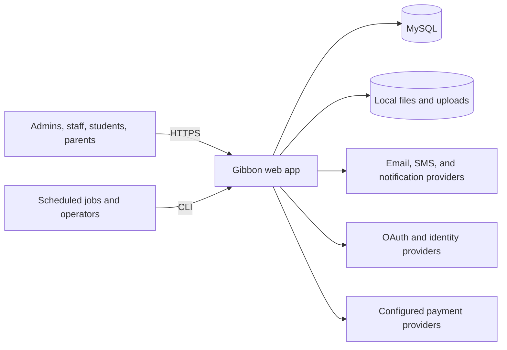
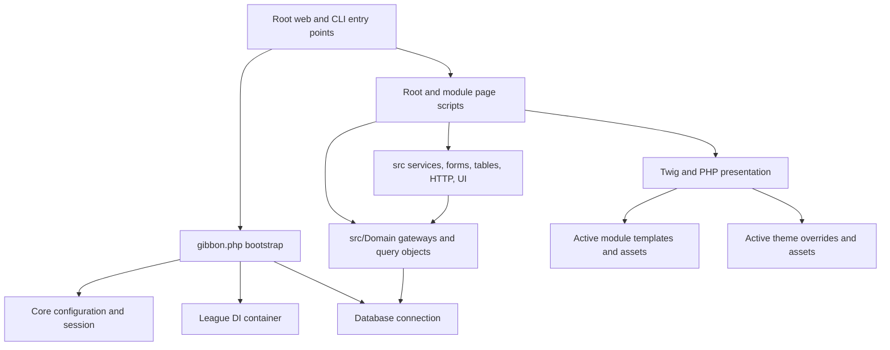

# Gibbon Core Architecture

- Status: living documentation for the v31-based downstream fork
- Last reviewed: 2026-08-21

## Purpose and Quality Goals

Gibbon is a PHP school-management application for administrators, staff,
students, parents, and support roles. This document explains the architecture
needed to change the system safely; it is not a complete catalog of features.

The priorities for this fork are:

1. Preserve an inexpensive, repeatable upgrade path from Gibbon upstream.
2. Protect sensitive school and personal data through explicit authorization,
   validation, and parameterized persistence.
3. Add downstream features through supported extension points.
4. Make small changes that fit both the legacy and modern parts of the codebase.

## Context

Provider integrations are optional and are selected through system settings.
The application remains responsible for authorization before data reaches any
external integration.

## Technical Constraints

- PHP 8.0 is the Composer platform minimum; CI currently exercises PHP 8.3.
- MySQL is the primary datastore.
- Composer provides PHP dependencies and the `Gibbon\` PSR-4 namespace.
- League Container supplies dependency injection, with reflection fallback.
- Twig renders shared, theme, and module templates.
- The application includes legacy procedural PHP alongside namespaced classes.
- `i18n/` and `resources/build/` are Git submodules maintained separately.
- Database upgrades use Gibbon's append-only `CHANGEDB.php` mechanism.

These constraints should be changed only as an explicit, tested architecture
decision rather than as incidental feature work.

## Building Blocks

| Path | Responsibility | Change guidance |
| --- | --- | --- |
| Root `*.php` | Web entry points, bootstrap consumers, compatibility endpoints | Treat as core; keep changes narrow and upstreamable. |
| `gibbon.php` | Autoloading, container setup, config, DB/session initialization, request safeguards | Critical bootstrap; avoid downstream behavior here. |
| `functions.php` | Legacy global compatibility functions | Reuse when necessary; do not add new feature domains here. |
| `src/` | Namespaced core services, contracts, gateways, forms, tables, HTTP and UI primitives | Preferred home for reusable core behavior. |
| `modules/<Core Module>/` | Page actions and module-specific behavior bundled with core | Upstream-owned even though it is under `modules/`. |
| Additional module | Independently installed feature package | Preferred home for downstream behavior. |
| `resources/templates/` | Core Twig templates | Theme or module overrides are preferred to downstream edits. |
| `themes/` | Theme manifests, assets, and optional template overrides | Preferred home for application-wide visual customization. |
| `cli/` | Scheduled and operator-invoked jobs | Reuse the main bootstrap and service layer. |
| `tests/` | Codeception install, acceptance, and unit suites | Add focused coverage with behavior changes. |
| `ops/`, `up.sh` | Docker development/runtime tooling | Keep environment-specific values in `.env`. |

### Core Bootstrap and Container

`gibbon.php` loads Composer and `functions.php`, creates the League container,
registers core/view/auth service providers, loads configuration, connects to
MySQL, initializes the session and locale, and exposes a small set of globals
for backwards compatibility.

The container delegates unresolved names to a reflection container. Explicit
service-provider registrations remain preferable when construction has side
effects, aliases, configuration, or interface bindings.

### Domain and Persistence

`src/Domain` contains gateways and query infrastructure. `Gateway` wraps the
database connection; `QueryableGateway` combines Aura SQL queries with Gibbon's
filtering, sorting, and pagination conventions. Page scripts should delegate
reusable reads and writes to this layer.

The schema is shared across core modules. Additional modules should own
module-specific tables and settings, prefix names consistently, and avoid
altering core tables unless an ADR documents why no extension alternative is
safe.

### Modules

There are two different kinds of module in this tree:

- Core modules are committed as part of Gibbon Core and upgraded with it.
- Additional modules are installable packages with their own lifecycle.

An additional module normally contains:

- `manifest.php` for installation metadata, actions, permissions, settings, and
  initial schema.
- `version.php`, `CHANGEDB.php`, and `CHANGELOG.txt` for its release lifecycle.
- Page and process scripts for actions.
- `src/` for namespaced domain and service code.
- `templates/`, `css/module.css`, and `js/module.js` for presentation.
- `i18n/` when the module ships translations.

For the active module, `ModuleLoader` maps
`Gibbon\Module\<NameWithoutSpaces>\` to that module's `src/` directory. Avoid
assuming every additional module namespace is globally available on every
request.

Actions and permissions are data-driven. A page's existence is not an
authorization boundary: each page and process must preserve the corresponding
action/role check. Module hooks can place module-owned output in supported core
surfaces without editing the target core module.

### Views, Themes, and Assets

The Twig loader starts with `resources/templates`, prepends templates from the
active theme, then prepends templates from the active module. This enables an
additional module to own its views and a theme to override shared templates.

Use module CSS and JavaScript for feature presentation. Use a theme for visual
behavior that spans modules. Avoid editing compiled or minified assets directly;
change their source and use the build process from the `resources/build`
submodule.

`index_custom.php` and `index_customSidebar.php` are deployment-local loaders
and are gitignored. They are not a durable feature mechanism for this fork.

## Runtime Views

### Web Request

1. Apache invokes a root endpoint or routes a module action through `index.php`.
2. The endpoint includes `gibbon.php`.
3. The bootstrap loads config, services, database, session, locale, and request
   safeguards. The active module namespace is registered when applicable.
4. `index.php` refreshes role and settings context, evaluates redirects and
   permissions, and prepares page state.
5. The selected root/module script validates input and calls services or
   gateways.
6. The page renders PHP output and Twig templates through the active module and
   theme layers.

The system does not have one centralized modern router or middleware pipeline.
Do not assume framework-style middleware covers authorization or validation in
every legacy endpoint.

### Mutating Form

1. A page checks action access and builds a form with the established form API.
2. The browser submits to a `*Process.php` endpoint with CSRF and nonce values.
3. The bootstrap validates request tokens; the process script repeats the
   relevant permission and validates domain input.
4. A gateway or parameterized connection call writes data.
5. The process redirects with a result code; the page renders feedback.

### CLI Job

CLI scripts under `cli/` bootstrap the same application services, perform their
domain operation, and are expected to be invoked by an operator or scheduler.
They must not depend on browser session authorization and need their own safe
configuration and logging behavior.

## Extension Strategy

This strategy is recorded in
[ADR 0001](docs/decisions/0001-prefer-supported-extension-points.md).

Use this decision table before implementation:

| Need | Preferred location | Upstream impact |
| --- | --- | --- |
| School-specific workflow or data | Separate additional module repository | None in core when installed/deployed separately. |
| Feature in a supported dashboard/profile surface | Additional module plus module hook | None or a small upstream hook improvement. |
| Module-specific UI | Module templates and assets | None. |
| Cross-application visual change | Additional theme | None. |
| General Gibbon defect | Small core commit suitable for upstream PR | Temporary until accepted/released. |
| Missing extension capability | Minimal generic core seam, then module implementation | Small and intentionally upstreamable. |
| Local runtime configuration | `.env`, `config.php`, deployment tooling | No application-core delta. |

Keep long-lived additional modules in separate repositories. Deployment can
install a released module or check out that repository under `modules/`. If the
team instead vendors or submodules an extension into this fork, record the
choice in an ADR because it changes release and upgrade ownership.

## Database Evolution

Core schema starts from `gibbon.sql` and evolves through the root
`CHANGEDB.php`. Each version block contains SQL statements separated by
`;end`. The updater tracks execution; published lines are immutable, and fixes
must be appended as new statements. Migrations are one-way.

Additional modules use the same pattern in their own package. Their manifest
creates the initial state and their `CHANGEDB.php` upgrades installed versions.
Keep module schema out of the core migration stream.

## Deployment

The primary production shape is Apache with PHP plus MySQL and writable runtime
storage. This repository also provides a Docker development shape:

- `app`: Apache/PHP with the repository mounted for live development.
- `db`: MySQL with a named volume.
- `.env`: local image versions, database credentials, Compose files, and port.
- `up.sh`: build/start, dependency install, logs, and destructive reset helpers.

Uploads, config, secrets, database contents, template caches, and installed
extensions are deployment state. Do not assume they are available in a new Git
worktree unless the environment setup explicitly supplies them.

## Cross-Cutting Concerns

- Authorization is role/action-based and stored in the database.
- Input safety uses server-side validation, CSRF/nonce tokens, parameterized
  queries, and constrained file handling.
- Localization uses gettext and module translation domains.
- Settings and current school/user context are loaded into the session.
- Compatibility globals remain available, but new reusable code should prefer
  explicit dependencies.
- Logs and notifications may contain sensitive context; minimize personal data.

## Testing and Delivery

Codeception provides install, acceptance, and unit suites. PHPStan provides
static analysis. CI installs dependencies, provisions MySQL, starts a PHP test
server, runs `composer test`, runs PHPStan, and inspects the server log for
runtime errors and warnings.

The test pyramid is constrained by legacy integration points. Add unit tests for
isolated services and gateways, then add acceptance coverage when behavior
depends on routing, roles, forms, sessions, or database installation.

## Known Architectural Risks

- Legacy scripts mix orchestration, presentation, and persistence.
- Globals and direct includes make hidden dependencies possible.
- Authorization is distributed across page/process endpoints.
- A shared relational schema increases coupling between core modules.
- Additional module autoloading is request/module scoped.
- Database upgrades are one-way and require operational backups.

Treat these as constraints to manage. Do not launch broad refactors during an
unrelated feature; isolate a small improvement and cover it with tests.

## Architecture Decisions

Record a decision in `docs/decisions/` when it changes module ownership, adds a
core extension seam, alters persistence boundaries, introduces a dependency,
or creates a long-lived upstream delta. Use `0000-template.md`, assign the next
four-digit number, and link the accepted ADR from the relevant section here.

- [ADR 0001: Prefer supported extension points](docs/decisions/0001-prefer-supported-extension-points.md)

Review this file when a change affects bootstrap, module/theme contracts,
deployment topology, persistence strategy, or the fork's upstream policy.

## Sources

- [Gibbon Core Development](https://docs.gibbonedu.org/explanation/development/core-development)
- [Gibbon Module Development](https://docs.gibbonedu.org/explanation/development/module-development)
- [Gibbon Developer Workflow](https://docs.gibbonedu.org/guides/development/developer-workflow)
- [Gibbon Database Changes](https://docs.gibbonedu.org/explanation/development/core-concepts/database-changes)
- [Gibbon Coding Standards](https://docs.gibbonedu.org/reference/coding-standards)
- [arc42 architecture documentation](https://arc42.org/documentation/)
- [Architectural Decision Record templates](https://adr.github.io/adr-templates/)
