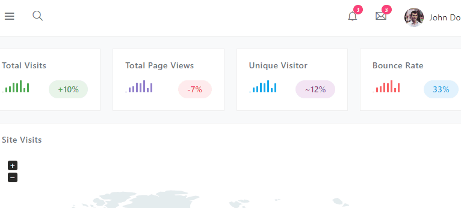

# Session Timeout

Warn users when their session is about to expire. Dependency-free.

When this function is called (usually each time a page is loaded), a timer starts in the background.
When the timer goes off, a warning is displayed to the user that their session is about to expire.
The user has two options: Log out now or stay connected. If they choose to log out, they are brought
to your site's log out page. If they choose to stay connected, a keep-alive URL is requested in the
background, the warning is hidden, and the timer resets.

This project is the successor to
[jquery-sessionTimeout](https://github.com/travishorn/jquery-sessionTimeout). I built this new
version to remove the dependency on jQuery and jQuery UI.



## Installation

### Method 1: CDN

Include the script on your page via UNPKG.

```html
<script src="https://unpkg.com/@travishorn/session-timeout"></script>
```

### Method 2: Download

Download [dist/session-timeout.js](dist/session-timeout.js).

Include it on your page.

```html
<script src="session-timeout.js"></script>
```

### Method 3: ES6 Module using npm and webpack (or similar)

Install via npm.

```
> npm install @travishorn/session-timeout
```

Include it in your scripts.

```javascript
import sessionTimeout from '@travishorn/session-timeout';
```

## Usage

Call it in JavaScript.

```javascript
sessionTimeout();
```

Provide options as an object.

```javascript
sessionTimeout({
  warnAfter: 60000,
  message: 'Are you still there?',
});
```

## Options

### appendTimestamp

If `true`, appends the a timestamp parameter to the end of the keep-alive URL with each request.
This can prevent caching issues by guaranteeing the URL is unique.

Default: `false`

Example URL: `/keep-alive?time=1551203965297`

### keepAliveMethod

The HTTP method to use when making the keep-alive request.

Default: `POST`

### keepAliveUrl

When the user clicks the "Stay connected" button, this URL is requested in the background to keep
their session alive.

Default: `/keep-alive`

### logOutBtnText

The text on the log out button.

Default: `Log out now`

### logOutUrl

When the user clicks the "Log out now" button, their browser is directed to this URL.

Default: `/log-out`

### titleText

The text displayed at the top of the dialog.

Default: `Session Timeout`

### message

The message to display when warning the user of inactivity.

Default: `Your session is about to expire.`

### stayConnectedBtnText

The text on the "stay connected" button.

Default: `Stay connected`

### timeOutAfter

The amount of time, in milliseconds, to wait until automatically timing out the user and redirecting
their client to the time-out URL. You will usually want to set this to the same amount of time your
server keeps sessions alive. This timer gets reset if the users clicks the "stay connected" button
on the warning dialog.

Default: `1200000` (20 minutes)

### timeOutUrl

Once the time out period has elapsed, the user's browser will be directed to this URL.

Default: `/timed-out`

### warnAfter

The amount of time, in milliseconds, to wait until displaying a warning to the user. If the
user clicks the "stay connected" button, the warning disappears, and the timer is reset. The warning
will re-appear after the same amount of time after reset.

Default: `900000` (15 minutes)
